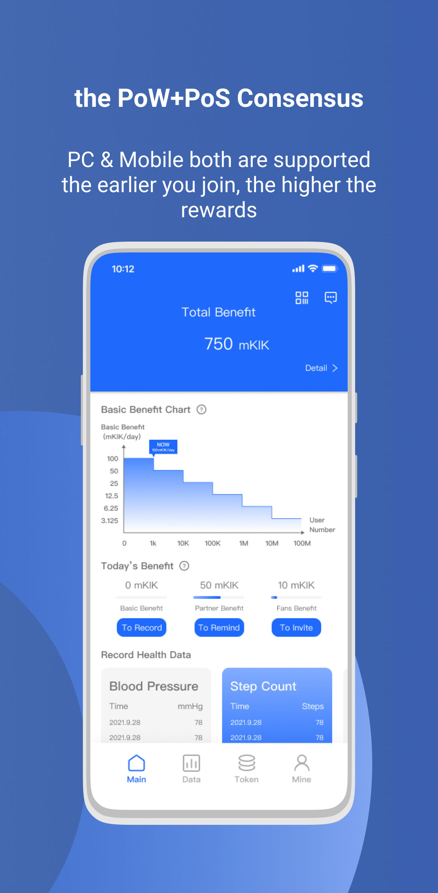
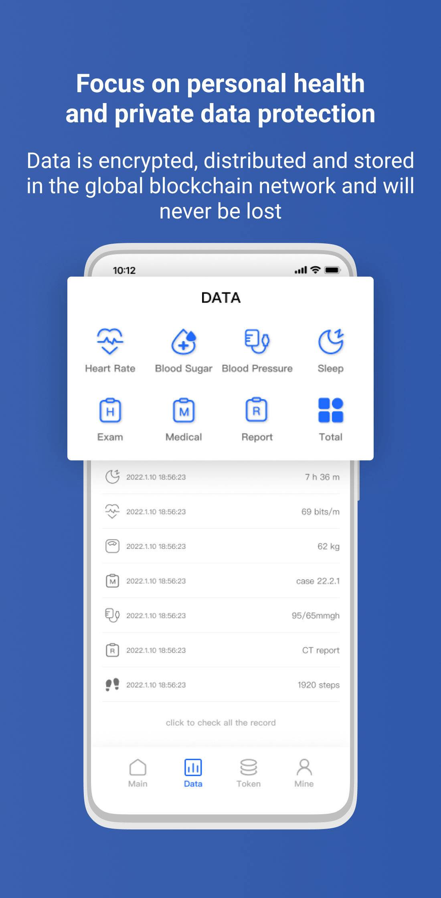
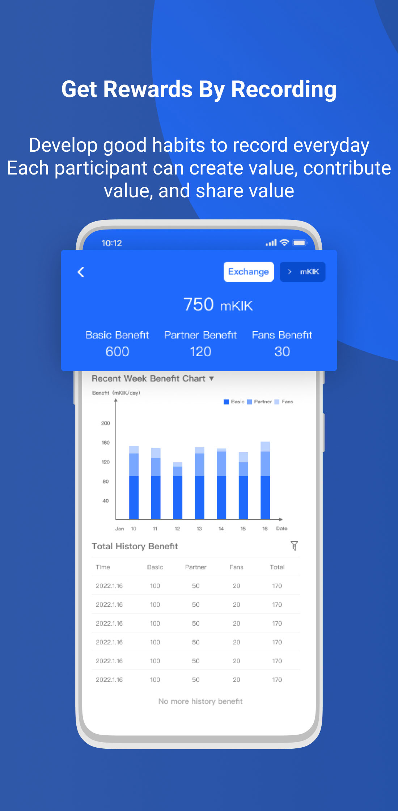
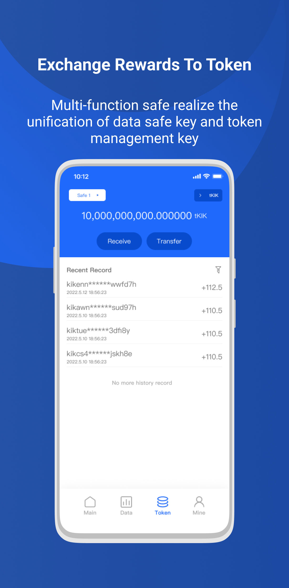

# kiwi-blockchain-app
App for Kiwi Network

Download Android Apk: [KiwiNetwork v1.1.1.apk](https://github.com/Kiwihealthcare-Network/kiwi-blockchain-app/releases/download/v1.1.1/KiwiNetworkv1.1.1.apk)

Kiwi Network is a Web3 decentralized health service platform and a healthy life metaverse. It advocates a positive and healthy lifestyle through the application of blockchain technology and encourages users to take the initiative to pay attention to their daily health. By maintaining regular exercise, they can be refreshed, happy, and have a more responsive brain. Encourage users to store their own and their families' health and medical data in the most secure and decentralized way possible in the global blockchain network to facilitate the safe and convenient storage, exchange, and use of data. Relying on the dual linkage token incentive mechanism of PC terminal and mobile terminal, it stimulates the motivation of user participation so that each participant can create value, contribute value, and share value. Generate data securely to unify the security key and token management key.

   

