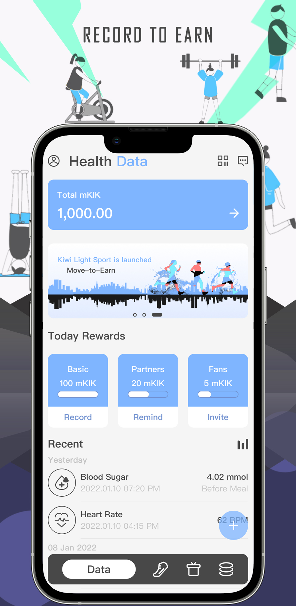
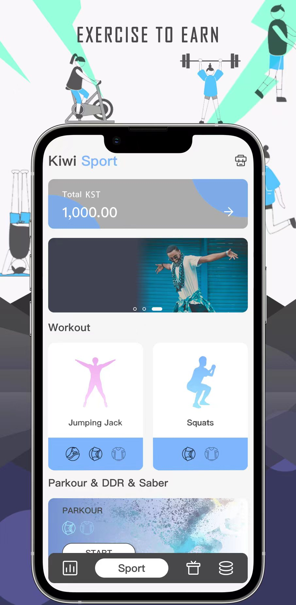
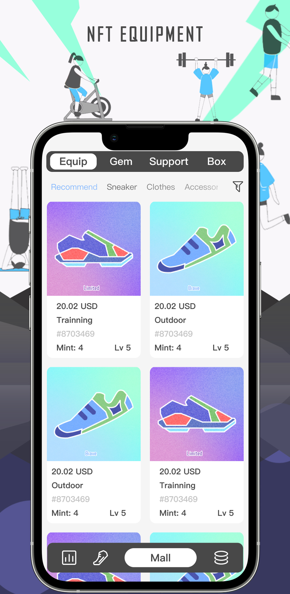
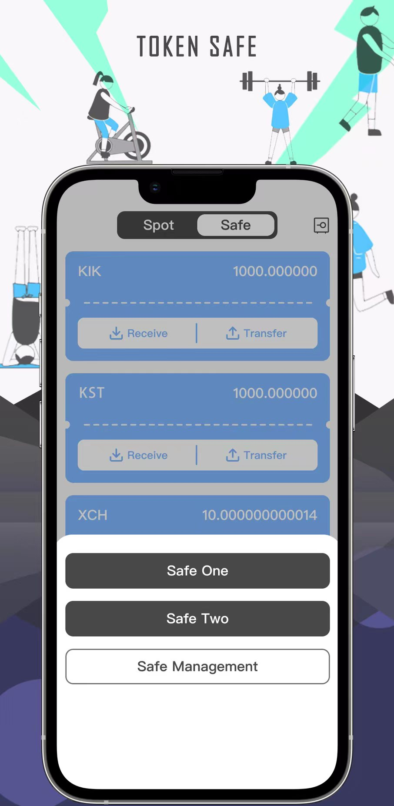

# kiwi-blockchain-app
App for Kiwi Network

Download Android Apk: [KiwiNetwork.2.1.2.apk](https://github.com/Kiwihealthcare-Network/kiwi-blockchain-app/releases/download/v2.1.2/KiwiNetwork.2.1.2.apk)

Kiwi Network is a Web3 decentralized healthy lifestyle platform that aims to conduct sociological experiments in the field of health care and healthy lifestyle. Kiwi Network advocates a positive and healthy lifestyle through the application of blockchain technology, and encourages users to take the initiative to pay attention to their daily health. By maintaining regular exercise, they can be refreshed, happy and have a more responsive brain. 

Based on Kiwi Network 1.0 which allow users can store their and their family’s health and medical data in the global blockchain network to get mKIK rewards. Kiwi 2.0 released a new AI visual-based light sport module, which allows users to perform movements on their mobile phones, such as jumping jacks, squats, push-ups, etc., and even do parkour on their mobile phones. The AI module can give intelligent scores to users' actions, calculate their energy consumption, and give certain KST and KMT rewards.

   

What’s new?

2.1.2
-  Add new version detection
-  Fixed some known bugs. 

2.1.1
- Fixed data save bug

2.1.0
- Integrate Kiwi mainnet wallet API
- Fixed some known bugs

2.0.1
- Fixed the calculation problem of parkour rewards
- Fixed some known bugs

2.0.0
- AI based Light sport modules
- Equipment NFT store

1.1.3
- Upgrade mobile terminal side economic model, only those users who collected health date by authenticated devices can obtain 100% basic benefit, while manual data entry can only obtain 25% of basic benefit at most.
- Integrate camera heart rate detection module as trusted or authenticated device.
- User can extract data from Google Health Connect as trusted or authenticated device.

1.1.2
- Upgrade mobile terminal side economic model, only those users who collected health date by authenticated devices can obtain 100% basic benefit, while manual data entry can only obtain 25% of basic benefit at most.
- Integrate camera heart rate detection module as trusted or authenticated device.
- User can extract data from Google Health Connect as trusted or authenticated device.

1.1.1
- Fixed some known bugs

1.1.0
- Add reminder push
- Fixed dark mode UI display abnormality
- Fixed some known bugs

1.0.1
- Fixed language setting
- User’s experience optimized

1.0.0
- App oneline

